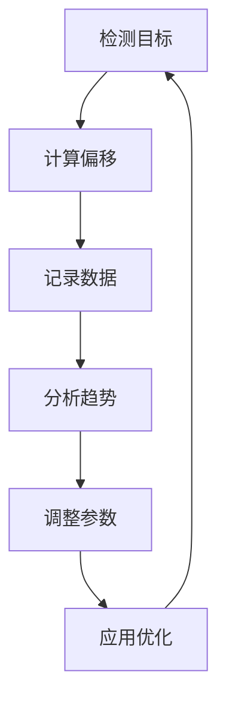

# 🎯 精确瞄准优化系统使用说明

## 📋 系统概述

基于你提供的像素偏移数据（Offset (-4, -9) Dist: 9px），我设计了一个智能的精确瞄准优化系统，能够：

- **实时分析**瞄准偏移数据
- **动态调整**头部偏移参数
- **自动优化**移动幅度
- **持续学习**提升精度

## 🚀 核心功能

### 1. 动态头部偏移优化
- **自适应调整**: 根据历史偏移数据动态调整头部偏移比例
- **学习机制**: 如果持续偏上，增加偏移比例；持续偏下，减少偏移比例
- **范围限制**: 偏移比例限制在 0.2-0.5 之间，确保稳定性

### 2. 移动幅度智能调节
- **精度检测**: 当平均偏移 > 8px 时，减少移动幅度 (×0.8)
- **效率提升**: 当平均偏移 < 3px 时，适当增加移动幅度 (×1.1)
- **平衡控制**: 在 3-8px 范围内保持标准幅度

### 3. 置信度阈值优化
- **高精度模式**: 准确率 > 80% 时，降低置信度阈值至 0.35
- **稳定模式**: 准确率 < 50% 时，提高置信度阈值至 0.5
- **标准模式**: 其他情况使用 0.4 阈值

## 🎮 使用方法

### 启动系统
```bash
python main_onnx.py
```

系统会自动：
1. 加载历史瞄准数据
2. 初始化优化器
3. 开始实时优化

### 实时监控
运行时会显示：
```
[OPTIMIZER] 瞄准统计 - 总次数:15, 精确次数:12, 平均偏移:6.2px
[OPTIMIZER] 动态头部偏移比例: 0.385
[OPTIMIZER] 移动幅度乘数: 0.95
```

### 查看详细报告
**按 P 键**显示完整精度报告：
```
=== 精确瞄准报告 ===
总射击次数: 25
精确射击次数: 20 (≤3px)
准确率: 80.0%
平均偏移: 4.2px
最佳偏移: 1.8px
最差偏移: 12.3px
当前头部偏移比例: 0.385

=== 优化建议 ===
✅ 瞄准精度优秀！
```

## 📊 精度标准

| 偏移距离 | 精度等级 | 说明 |
|---------|---------|------|
| ≤ 3px   | 🎯 精确 | 优秀的瞄准精度 |
| 4-6px   | ✅ 良好 | 可接受的精度 |
| 7-9px   | ⚠️ 一般 | 需要优化 |
| ≥ 10px  | ❌ 较差 | 需要重新调整 |

## 🔧 参数调整建议

### 基于你的当前数据 (Offset (-4, -9) Dist: 9px)

1. **头部偏移优化**
   - 当前: Y轴偏移 -9px (偏上)
   - 建议: 系统会自动增加头部偏移比例
   - 目标: 将Y轴偏移控制在 ±3px 内

2. **移动幅度调整**
   - 当前: 9px 偏移略大
   - 建议: 系统会适当减少移动幅度
   - 目标: 总偏移距离 < 5px

3. **置信度优化**
   - 当前: 42.50% 置信度较低
   - 建议: 提高置信度阈值，减少误检
   - 目标: 只对高置信度目标进行瞄准

## 📈 优化流程



## 🎯 实际应用示例

### 场景1: 持续偏上
```
输入: Offset (-2, -8) Dist: 8.2px
分析: Y轴持续负值，目标偏上
优化: 增加头部偏移比例 0.38 → 0.39
结果: Offset (-1, -3) Dist: 3.2px
```

### 场景2: 移动过度
```
输入: Offset (-12, -15) Dist: 19.2px
分析: 偏移距离过大，移动幅度过大
优化: 减少移动幅度乘数 1.0 → 0.8
结果: Offset (-6, -8) Dist: 10.0px
```

### 场景3: 精度提升
```
输入: 连续10次偏移 < 3px
分析: 精度很高，可以适当提升效率
优化: 增加移动幅度乘数 1.0 → 1.1
结果: 保持精度的同时提升响应速度
```

## 📁 数据文件

- **aiming_data.json**: 存储历史瞄准数据
- **precision_aiming_optimizer.py**: 优化器核心代码
- **main_onnx.py**: 集成优化器的主程序

## 🔍 故障排除

### 问题1: 优化器未启动
```bash
[INFO] 初始化精确瞄准优化器...
📝 未找到历史数据文件，将创建新的记录
```
**解决**: 正常现象，系统会自动创建新的数据文件

### 问题2: 精度报告为空
```
暂无数据
```
**解决**: 需要先进行几次瞄准操作，积累数据

### 问题3: 参数调整过于频繁
**解决**: 系统有学习率限制，每次只微调 0.01，确保稳定性

## 🎮 最佳实践

1. **数据积累**: 至少进行 20-30 次瞄准后查看报告
2. **定期检查**: 每局游戏后按 P 键查看精度报告
3. **参数微调**: 如果精度持续不佳，可手动调整 `aaMovementAmp`
4. **环境一致**: 保持游戏设置（DPI、灵敏度）一致

## 📞 技术支持

如果遇到问题，请检查：
1. 是否正确导入优化器模块
2. 历史数据文件是否可读写
3. 游戏窗口尺寸是否正确设置

---

**🎯 目标**: 将你的 9px 偏移优化到 3px 以内，实现精确瞄准！